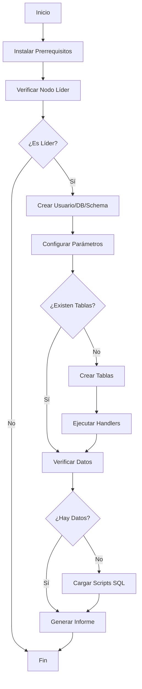

# Database Init Role

## Descripción

Este rol de Ansible automatiza la inicialización completa de una base de datos PostgreSQL en un cluster Patroni de alta disponibilidad. El rol detecta automáticamente el nodo líder del cluster y ejecuta todas las operaciones solo en ese nodo para mantener la consistencia.

## Características

- Detección automática del nodo líder Patroni
- Creación de usuario, base de datos y schema
- Configuración de parámetros (search_path, timezone)
- Creación de estructura de tablas con constraints
- Carga de datos iniciales desde scripts SQL
- Generación de informe detallado post-instalación
- Manejo robusto de errores con rescue blocks
- Idempotencia completa

## Requisitos

### Sistema Operativo

- Rocky Linux 9 / RHEL 9 / CentOS 9
- Python 3.x instalado

### Software

- PostgreSQL 17+
- Patroni 4.0+
- Ansible 2.9+

### Módulos de Ansible

```yaml
collections:
  - community.postgresql
```

### Paquetes Python

- `python3-psycopg2`

## Variables del Rol

### Defaults (`defaults/main.yml`)

| Variable      | Descripción                 | Valor por defecto         |
| ------------- | --------------------------- | ------------------------- |
| `db_name`     | Nombre de la base de datos  | `doc-mgr_template-mgr-db` |
| `db_schema`   | Schema de la base de datos  | `mgrtigodb`               |
| `db_user`     | Usuario de la base de datos | `admin_db_gestordoc`      |
| `db_password` | Contraseña del usuario      | `admin_db_1*`             |
| `db_timezone` | Zona horaria de la BD       | `America/Bogota`          |

### Variables Requeridas (desde el playbook o inventario)

| Variable            | Descripción                          | Ejemplo           |
| ------------------- | ------------------------------------ | ----------------- |
| `postgres_user`     | Usuario administrativo de PostgreSQL | `postgres`        |
| `postgres_password` | Contraseña del usuario postgres      | `MySecurePass123` |
| `ansible_host`      | IP del host PostgreSQL               | `192.168.20.80`   |

## Estructura del Rol

```
database_init/
├── defaults/
│   └── main.yml              # Variables por defecto
├── files/
│   ├── 1_formalities_1.sql   # Script SQL: datos de formalities
│   ├── 2_templates.sql       # Script SQL: datos de templates
│   └── 3_template_labels_1.sql # Script SQL: datos de template_labels
├── handlers/
│   └── main.yml              # Handlers para constraints
├── tasks/
│   ├── main.yml              # Orquestador principal
│   ├── prerequisites.yml     # Instalación de dependencias
│   ├── check_leader.yml      # Verificación nodo líder Patroni
│   ├── create_database.yml   # Creación de usuario, DB y schema
│   ├── configure_database.yml # Configuración de parámetros
│   ├── create_tables.yml     # Creación de estructura de tablas
│   ├── load_data.yml         # Carga de datos desde SQL
│   └── generate_report.yml   # Generación de informe final
└── README.md
```

## Ejemplo de Uso

### Playbook básico

```yaml
---
- name: Inicializar Base de Datos PostgreSQL
  hosts: pgcluster
  become: yes
  vars:
    postgres_user: postgres
    postgres_password: "{{ vault_postgres_password }}"

  tasks:
    - name: ROLE - Inicializar la DB
      ansible.builtin.include_role:
        name: database_init
        apply:
          tags: database_init
      tags: ["database_init"]
```

### Inventario de ejemplo

```ini
[pgcluster]
rocky9node1 ansible_host=192.168.20.80
rocky9node2 ansible_host=192.168.20.82
```

## Tags Disponibles

| Tag                 | Descripción                     |
| ------------------- | ------------------------------- |
| `database_init`     | Ejecuta el rol completo         |
| `prerequisites`     | Solo instala prerrequisitos     |
| `leader_check`      | Solo verifica el nodo líder     |
| `database_creation` | Solo crea usuario, DB y schema  |
| `database_config`   | Solo configura parámetros de DB |
| `table_creation`    | Solo crea estructura de tablas  |
| `data_loading`      | Solo carga datos desde SQL      |
| `report`            | Solo genera el informe final    |

## Flujo de Ejecución



## Estructura de Tablas

El rol crea las siguientes tablas:

### 1. `document_types`

- Almacena tipos de documentos
- Primary Key: `name`

### 2. `formalities`

- Gestiona trámites formales
- Primary Key: `name`

### 3. `metadata`

- Metadatos de documentos
- Primary Key: `name`
- Foreign Key: `document_type_name` → `document_types(name)`

### 4. `templates`

- Plantillas de documentos
- Primary Key: `(name, version)`

### 5. `template_labels`

- Etiquetas de plantillas
- Primary Key: `(template_name, template_version, name)`
- Foreign Key: `(template_name, template_version)` → `templates(name, version)`

## Handlers

Los handlers se ejecutan automáticamente después de crear las tablas para agregar:

- Constraints CHECK
- Primary Keys
- Foreign Keys
- Índices

## Informe de Salida

Al finalizar, el rol genera un informe detallado que incluye:

```
╔═══════════════════════════════════════════════════════════════════
║                    RESUMEN DE INICIALIZACIÓN DE BASE DE DATOS
╠═══════════════════════════════════════════════════════════════════
║ Base de Datos: doc-mgr_template-mgr-db
║ Schema: mgrtigodb
║ Usuario: admin_db_gestordoc
╠═══════════════════════════════════════════════════════════════════
║                              ESTADO DE TABLAS
╠═══════════════════════════════════════════════════════════════════
║ document_types      │     15 registros │ Última: 2025-07-25 14:52:23
║ formalities         │     10 registros │ Última: 2025-07-25 14:52:23
║ metadata            │     25 registros │ Última: 2025-07-25 14:52:23
║ template_labels     │     45 registros │ Última: 2025-07-25 14:52:24
║ templates           │     20 registros │ Última: 2025-07-25 14:52:24
╠═══════════════════════════════════════════════════════════════════
║ TOTAL DE REGISTROS: 115
╚═══════════════════════════════════════════════════════════════════
```

## Troubleshooting

### Error: "No se puede conectar a PostgreSQL"

- Verificar que PostgreSQL esté ejecutándose
- Verificar credenciales en las variables
- Verificar conectividad de red

### Error: "El nodo no es líder"

- El rol solo ejecuta en el nodo líder de Patroni
- Verificar estado del cluster: `patronictl -c /etc/patroni.yml list`

### Error: "Fallo al cargar scripts SQL"

- Verificar que los archivos SQL existan en `files/`
- Verificar permisos de los archivos
- Revisar sintaxis SQL en los scripts

## Seguridad

- Use Ansible Vault para las contraseñas:
  ```bash
  ansible-vault encrypt_string 'MyPassword' --name 'vault_postgres_password'
  ```
- Limite el acceso al usuario de base de datos creado
- Configure pg_hba.conf apropiadamente

## Autor

---

**Autor**: cgarzont (NTTDATA)
**Última actualización**: Junio 2025  
**Versión**: 1.0.0
